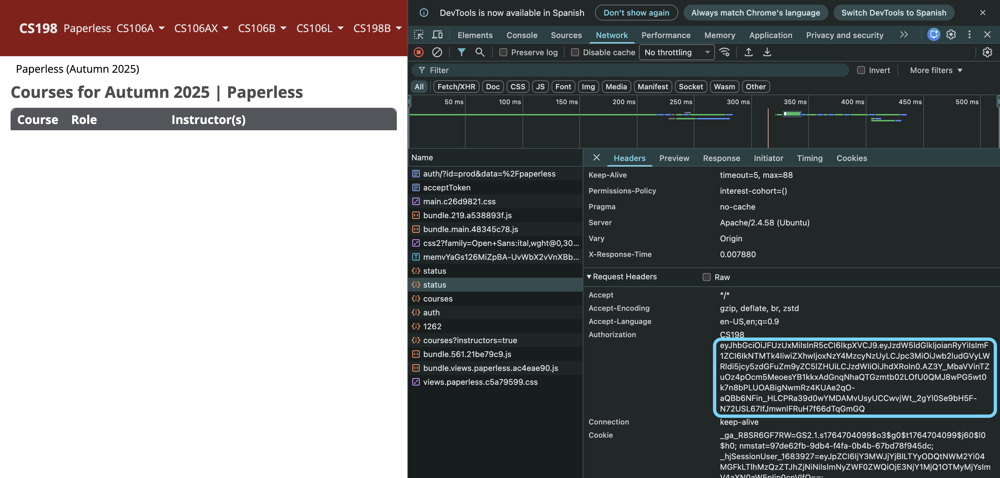

## Usage

Create a `shifts.yaml` by copying `shifts.template.yaml`. Make sure to appropriately modify `quarter` and `cohorts` inside of `shifts.yaml` before running.

```sh
python3 -m venv venv
source venv/bin/activate
pip install -r requirements.txt
python3 assign.py shifts.yaml --token [token]
```

To get the value of `token`, navigate to Paperless, right click > **Inspect**, go to the **Network** tab, refresh the page, click on the `status` request, click on **Headers**, scroll down to **Request Headers**, and then copy the value of the **`Authorization`** header:



Token should look like `eyJhbGciOiJFUzUxMi...` (it should not include the `CS198` prefix).